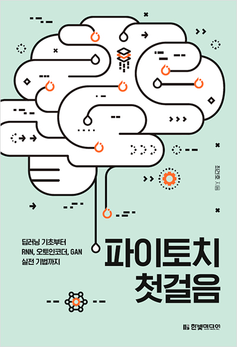

# Pytorch Tutorial

책 내용 정리 중

---

#### [Chapter 3. Linear Regression](https://github.com/aiaaua/pytorch_tutorial/tree/main/chapter3)

#### [Chapter 4. Artificial Neural Network](https://github.com/aiaaua/pytorch_tutorial/tree/main/chapter4)

#### [Chapter 5. Convolutional Neural Network](https://github.com/aiaaua/pytorch_tutorial/tree/main/chapter5)

#### [Chapter 6. Recurrent Neural Network](https://github.com/aiaaua/pytorch_tutorial/tree/main/chapter6)

#### [Chapter 7. Problems and Solutions](https://github.com/aiaaua/pytorch_tutorial/tree/main/chapter7)

#### Chapter 8. Neural Style Transfer

#### Chapter 9. Autoencoder

#### Chapter 10. Generative Adversarial Network

---

#### Reference

http://bit.ly/2U7ttYT

